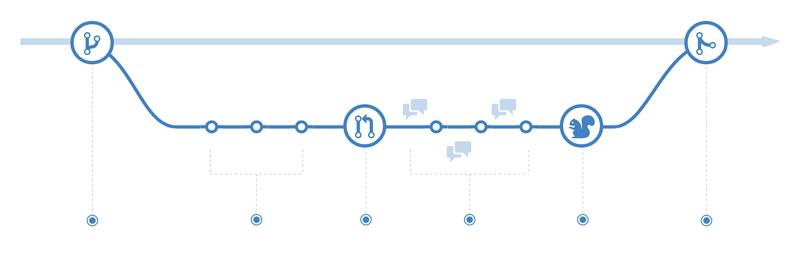

# Compartir y Actualizar Proyectos

### Enviar cambios al repositorio remoto

- ==git push origin [nombre de la rama]==: Envía una rama local al repositorio remoto.
- ==git push -u origin [nombre de la rama]==: Envía cambios al repositorio remoto y te posiciona en la rama concreta para futuras actualizaciones.
- ==git push==: Envía los cambios en la rama actual al repositorio remoto.
- ==git push origin --delete [nombre de la rama]==: Elimina una rama remota.

### Actualizar desde el repositorio remoto

- ==git pull==: Actualiza el repositorio local al último commit enviado.
- ==git pull origin [nombre de la rama]==: Trae todos los cambios de una rama específica desde un repositorio remoto.

### Gestión de repositorios remotos

- `git remote add origin ssh://git@github.com/[nombreDeUsuario]/[nombre-del-repo].git`: Añade un repositorio remoto a tu configuración local.
- `git remote set-url origin ssh://git@github.com/[nombreDeUsuario]/[nombre-del-repo].git`: Cambia la URL de un repositorio remoto para usar SSH en lugar de HTTPS.

---

!!! note "Consejo"
    Al utilizar `git pull`, es importante asegurarse de que no haya conflictos entre tu código local y el remoto. 

